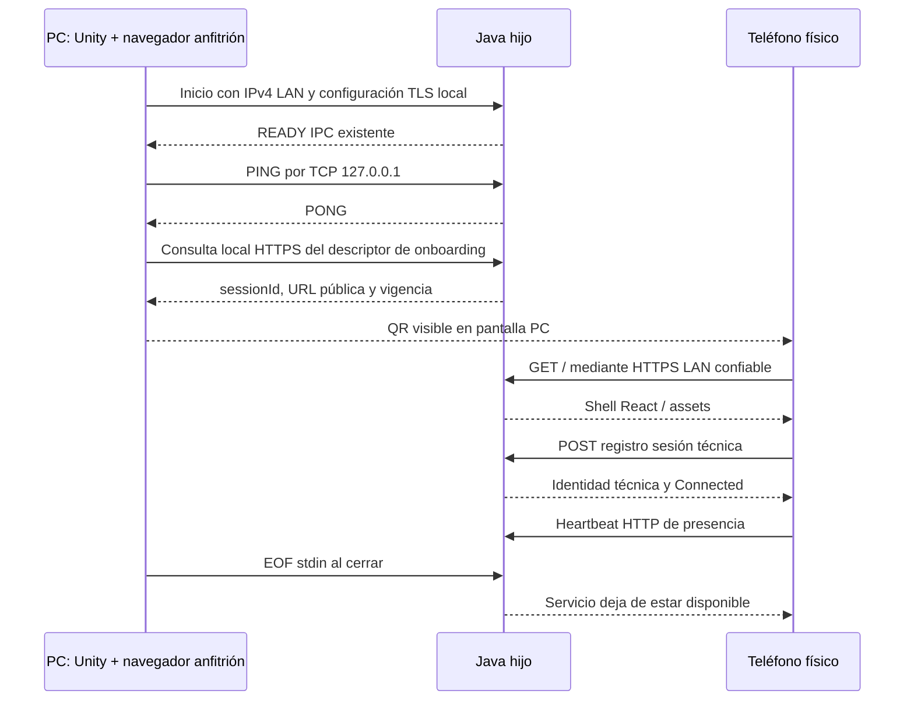

> **Vigente para3A:** arquitectura FQDN/DNS local/TLS público/443→8443 Accepted con adaptación software autorizada; ver [rediseño](PHASE0_PHONE_LAN_ONBOARDING_REDESIGN.md) y [validación](PHASE0_PHONE_3A_VALIDATION.md). El contenido CA/SAN IP siguiente es histórico, no experiencia de producto ni autorización de3B. Infraestructura y gate físico pendientes.

# Incremento 3 — Teléfono real → LAN → HTTPS → QR → Java

> **Estrategia TLS/onboarding superada por requisito posterior del PO.** La CA local instalada en teléfonos no cumple la UX definitiva. Producto acepta PWA + Flutter Android opcional; [rediseño vigente Accepted](PHASE0_PHONE_LAN_ONBOARDING_REDESIGN.md) aprobado para adaptación software3A; infraestructura pendiente. #94 permanece DRAFT. El contenido siguiente conserva la aprobación histórica, no autoriza continuar con setup CA ni3B.

**Estado: Accepted.** Fecha: 2026-10-06. Arquitectura general aprobada por el Product Owner; implementación autorizada exclusivamente para 3A. 3B NOT STARTED, requiere autorización separada. Base obligatoria confirmada mediante fetch: HEAD y origin/develop `ec5880c94304e8c7d587c5f5d8c2cf28dbf5a760`. Unity Foundation e Incremento 2 PASS / MERGED; Fase 0 IN PROGRESS; Fase 1 NOT STARTED. Preparación documental original sin implementación; aprobación posterior autoriza sólo 3A. Ninguna prueba física se presume PASS.

## 1. Fuentes y estado real

Revisados [v4](Gorilla_Escape_Gorilimpiadas_Especificacion_Maestra_v4.md) §§3,5–8,39–42,48–53, [reglas](DEVELOPMENT_RULES.md), [workflow](WORKFLOW.md), [DEC-005](PHASE0_UNITY_JAVA_DECISION.md), [TEST_REPORT](TEST_REPORT.md), [progreso](DEVELOPMENT_PROGRESS.md), servidor, React, service worker, Shared/Protocol y supervisor Unity.

- Java21/Spring Boot4.1.1: `application.properties` permite address/port configurables; default HTTP `127.0.0.1:8080`. `/api/health` confirma versión genérica, no sesión. No hay endpoints JOIN, sesión móvil, TLS, QR ni WebSocket implementado.
- Maven incorpora `PWA/dist` como static dentro del JAR. React19.3/Vite8.3.2, assets locales, manifest y worker generado con cache de shell por hash; `/api/*` no se cachea. Root `/` funciona. `/join` no tiene fallback implementado.
- Unity fuerza actualmente HTTP `127.0.0.1:0` al lanzar Java. IPC escucha aparte en `127.0.0.1:0`; READY estricto tiene cinco campos, incluido `httpPort`. No ampliar ese contrato ni parser para onboarding.
- Autoridad Unity de gameplay/resultados intacta; Java administra exclusivamente transporte y presencia técnica. No crear GameSession/PlayerProfile/torneo. Fixtures SENSOR existentes no se reutilizan como contrato de onboarding HTTP.

## 2. División que reduce riesgo

**Recomendación 3A → 3B con gates independientes.** 3A elimina el riesgo externo de confianza TLS/red real antes de implementar sesión/QR. 3B prueba onboarding sobre la misma URL HTTPS ya validada. No son autorizaciones de implementación ni de iniciar 3B automáticamente.

| Bloque | Incluye | Gate |
|---|---|---|
| 3A LAN + HTTPS | Configuración explícita LAN/TLS, assets empaquetados, preparación CA/teléfono, health real, offline con LAN | Teléfono físico abre URL manual HTTPS sin advertencias, carga React y contacta Java, sin Internet; IPC sigue loopback |
| 3B QR + onboarding | Pantalla PC, QR, sesión técnica efímera, registro/presencia HTTP y errores visibles | Escaneo real, coincidencia de sesión, Connected comprobado, refresh/reapertura, expiración y desconexión reproducibles |

## 3. Arquitectura y ownership

Un único Java ya supervisado por Unity sirve HTTPS móvil. Sin proxy, segundo backend, Vite público ni proceso Java adicional. Perfil LAN opt-in; perfiles de regresión IPC mantienen HTTP loopback/puerto0. Unity conserva start/EOF/cleanup y sólo termina su hijo. Fallo bind/certificado impide readiness del perfil móvil: error recuperable en PC, sin fallback HTTP inseguro.

El descriptor se obtiene por HTTPS con validación TLS normal desde el navegador de la PC usando la misma CA preparada, no mediante un nuevo mensaje IPC. Una vista React `/#host` muestra descriptor y QR, sin endpoints privilegiados. Unity conserva supervisión y puede indicar al anfitrión la URL para abrir esa vista; no necesita cliente HTTPS C#, nueva confianza Mono ni renderer QR C#. Java no toma autoridad de juego. `Connected` significa presencia HTTP reciente y sesión técnica correcta, no control jugable listo.

## 4. Interfaces y puertos

| Superficie | Binding recomendado | Exposición |
|---|---|---|
| IPC interno | `127.0.0.1:0`, elegido por Java | Sólo PC, token de lanzamiento jamás sale al móvil |
| HTTPS móvil | Una IPv4 privada LAN explícita, puerto configurable default8443 | Shell y endpoints mínimos del onboarding |
| HTTP de desarrollo | Loopback8080 / puerto0 según perfil existente | No habilitado como conector adicional en perfil móvil |
| Vite | Loopback existente | No utilizado por teléfono/demostración |

El anfitrión selecciona adaptador y dirección antes de lanzar. Enumerar interfaces activas IPv4 para diagnóstico, sin elegir silenciosamente primera/default route. Mostrar Wi-Fi/Ethernet, nombre y subnet; excluir loopback, link-local169.254/16 y VPN/túneles/virtuales por defecto, selección manual explícita si configuración académica lo necesita. Usar dirección privada RFC1918. Wi-Fi teléfono y Ethernet PC pueden funcionar en mismo segmento accesible; mismo SSID no prueba conectividad (guest/AP isolation/VLAN). No binding `0.0.0.0`/`::`, IPv6 ni selección automática sofisticada en este Spike.

Preferir reserva DHCP en router académico para estabilizar la IP; no editar router automáticamente. Puerto ocupado: informar y elegir otro manualmente antes de relanzar, nunca fallback silencioso. Cambio de IP: URL/QR/certificado quedan inválidos; detener onboarding, reconfigurar dirección, emitir certificado con SAN nuevo y relanzar manualmente con sesión nueva. No migración automática. Diagnóstico PC detecta desaparición de dirección al consultar descriptor y marca QR obsoleto. Si teléfono está en otra red, indicar Wi-Fi esperada y comprobar alcance; no usar hotspot/cloud/túnel como solución automática.

## 5. HTTPS y confianza

| Opción | Evaluación |
|---|---|
| Certificado leaf autofirmado sin CA confiable | Rechazado: advertencias y contexto no verificable; no pedir continuar inseguramente |
| CA local + certificado SAN para IPv4 + HTTPS directo Spring | **Recomendado**: offline, sin DNS, un runtime de servidor; setup explícito en cada teléfono |
| Hostname `.local` / DNS LAN con CA local | Posible, pero añade resolución mDNS/DNS y variación Android/red; diferido |
| Certificado público/dominio o reverse proxy | No necesario; gestión externa/proceso adicional sin beneficio para este gate |

Recomendar **mkcert como herramienta de preparación**, no dependencia runtime Java/React, y conversión a PKCS12 con herramientas locales. Su uso/instalación sigue pendiente de aprobación con este diseño; no descargar ahora. Alternativa de generación manual con OpenSSL/keytool evita herramienta pero aumenta pasos propensos a errores; no mantener dos procedimientos oficiales.

Setup previo, realizado con responsable y teléfonos identificados:

1. Instalar herramienta verificada y crear CA exclusiva de la demo en PC. Confiar explícitamente en PC/navegador anfitrión. Generar certificado leaf con SAN de la IPv4 seleccionada; no usar CN como sustituto de SAN.
2. Crear PKCS12 externo al repositorio y configurar Spring mediante configuración local externa `server.ssl.*`; TLS1.2/1.3, validación normal. Spring soporta keystores y configuración TLS del servidor embebido; no crear conector HTTP paralelo. [Spring oficial](https://docs.spring.io/spring-boot/how-to/webserver.html).
3. Transferir **sólo certificado público CA** por USB/medio controlado, verificar fingerprint con responsable e instalar en teléfonos autorizados. No descargar la CA desde una página con error TLS como bootstrap.
4. Android: instalar como CA de usuario en ajustes de seguridad; menús y política varían por fabricante/gestión. Chrome real es candidato de referencia, no garantía universal. Dispositivo administrado puede impedir instalación. [Google, certificados Pixel](https://support.google.com/pixelphone/answer/2844832?hl=en).
5. iPhone: instalar perfil de certificado y habilitar confianza SSL/TLS completa en ajustes de confianza; instalación manual por sí sola no basta. Probar Safari real. [Apple](https://support.apple.com/en-us/102390).
6. Abrir URL manual; verificar cadena, SAN, fechas, reloj y `isSecureContext`. Sin advertencias ni aceptación de excepciones. Sólo entonces permitir onboarding normal mediante QR.

Almacenamiento propuesto: directorio privado del operador fuera de Git/PWA/JAR; root key600/directorio700 en Linux, ACL equivalente en Windows. Root privada sólo PC de preparación, nunca distribuida ni servida. Keystore leaf/password por archivo local con permisos; no argumentos, URL ni logs. Paths/fingerprint público pueden usarse para diagnóstico sanitizado. Expiración visible en PC; bloquear certificado expirado o próximo a demo sin vigencia suficiente. Renovar leaf antes de vencer o ante cambio de SAN, misma CA permite conservar trust; CA reemplazada exige reinstalar confianza. No prometer renovación automática ni bypass de reloj.

Después de preparar herramientas/build/certificados, servir y validar no exige Internet. La CA instalada concede confianza al emisor: usar exclusivamente teléfonos de prueba consentidos, retirar CA al finalizar setup/demo si ya no se necesita. Limitación académica explícita: convidados sin CA preparada no tienen onboarding cero-config. No presentar esto como distribución pública final. [mkcert oficial](https://github.com/FiloSottile/mkcert).

## 6. QR y contrato HTTP mínimo propuesto

**URL conceptual:** `https://<IPv4-LAN>:<puerto>/#join?v=1&sessionId=<UUID-efimero>`.

Elegir `/` con fragmento porque la raíz ya está servida/cacheada; no inventar ruta `/join` sin fallback. React lee el fragmento y envía sessionId explícito a Java. `v=1` es versión **de onboarding**, separada de IPC/Gorilla Protocol. sessionId es localización pública, no autorización. El fragmento no viaja en petición HTTP inicial, reduce trazas involuntarias; no incluir IPC token, credentials, IP del teléfono ni nombre. Descriptor aporta vigencia; no depender del reloj móvil ni añadir `expires` al QR. Copiar URL y QR representa misma capacidad de acceso LAN, no secreto persistente.

Contrato a documentar con fixtures específicos en `Shared/Protocol/onboarding/`, sin reutilizar envelope SENSOR ni crear C# DTOs si Unity sólo requiere descriptor. Java/JS deben compartir nombres/tipos/fixtures; versión independiente y campos estrictamente mínimos.

| Endpoint conceptual | Request / response | Propósito |
|---|---|---|
| GET `/api/onboarding/descriptor` | `onboardingVersion, serverInstanceId, sessionId, joinUrl, expiresAt` | PC muestra QR y reconoce lanzamiento; información pública |
| POST `/api/onboarding/join` | `version, sessionId, deviceId` → identidad servidor/sesión, leaseMs y estado | Confirmación real de pertenencia |
| POST `/api/onboarding/heartbeat` | Mismos IDs → estado/lease | Presencia técnica reciente |
| POST `/api/onboarding/leave` | Mismos IDs → confirmación | Cierre explícito opcional; no depender de unload |

`serverInstanceId` técnico nuevo por lanzamiento puede correlacionar al IPC instanceId pero no incluye token. Sesión de onboarding única en memoria, UUID aleatorio, vigencia propuesta30min desde READY, creada por Java como **contexto de transporte**. No representa GameSession ni decisiones de torneo. Expiración invalida QR/registros, PC muestra expirado; relanzamiento manual crea contexto nuevo. Posterior sesión de juego deberá ser originada por Unity y asociar transporte tras contrato aprobado, sin asumir que este UUID ya sea SessionId competitivo.

DeviceId UUID efímero por sesión, almacenado localmente por React con sessionId para permitir refresh/cerrar-reabrir; descartar al cambiar sesión/expirar. No persistencia de perfiles ni fingerprint hardware. Máximo4 registros, join idempotente por deviceId, registros desconectados reutilizables; bounded map, sin historial creciente. IDs públicos no son autenticación y pueden ser imitados por un usuario LAN; Spike no cubre adversario del mismo segmento. Confirmar contenido JSON y UUID, versión y sesión; límite request1KiB, respuestas pequeñas; códigos estables sin stack traces.

Same-origin, sin CORS wildcard ni endpoints administrativos remotos. Validar Host contra dirección/puerto configurados; POST JSON y Origin esperado (incluye cliente PC del mismo origin), sin cookies ni secretos de usuario. GET descriptor/health no mutan. Limitar rutas a shell/manifest/icons/sw/assets, health y onboarding; APIs desconocidas404, no fallback shell para `/api`. No Actuator/debug/salida IPC ni archivos CA/keystore accesibles. QR en PC: una biblioteca QR pequeña de build/runtime web puede ser necesaria, **propuesta pendiente de aprobación y revisión licencia/tamaño**, no implementar encoder propio ni añadir silenciosamente dependencias.

## 7. Flujo y presencia

PC muestra dirección/red/puerto/estado del certificado/vigencia, QR y URL copiable. Jugador usa lector QR externo del sistema; la PWA no pide cámara. Compatibilidad: HTTPS seguro, fetch/JSON/AbortController, almacenamiento disponible (fallback memoria explicado), servicio worker para cache; no comprobar ni pedir sensores. Si SW no funciona no certificar gate offline-cache, aunque health funcione.

Estados PWA: `WAITING_FOR_QR → CHECKING → CONNECTED`; fallo a `ERROR_RECOVERABLE`, lease perdido a `DISCONNECTED`; expiración a `SESSION_EXPIRED`. Reintentar es acción visible; ningún bucle join/reconnect infinito. El shell por sí solo nunca muestra Connected. Refresh/reapertura exige join idempotente y respuesta actual de Java antes de Connected.

Presencia por HTTP: heartbeat5s, timeout de request5s, un request pendiente, cancelación al desmontar/salir; Java lease15s desde última petición válida usando reloj monotónico. Una respuesta confirma lease; error visible de conexión, servidor marca desconectado al vencer. Consulta estado PC puede mostrar conteo técnico. Botón desconectar usa leave; unload/beacon sólo best effort. Background/suspensión móvil puede detener timers: desconectado técnico es esperado, no promesa de conexión persistente. Al volver visible, revalidar una vez; si falla, retry manual. No WS movimiento ni sesión de gameplay, y no alterar deadlines del IPC.

## 8. Offline y worker existente

Offline significa **LAN disponible sin WAN**, no PC apagada ni teléfono sin Wi-Fi. Primer acceso incluso en teléfono sin cache debe cargar desde JAR preparado con Internet retirado. Manifest/assets/fuentes/iconos/QR library deben ser locales; nada CDN/analytics/remote cert validation dependency para el setup elegido. Worker actual ya cachea assets y excluye API; conservarlo, sin background sync/push ni cache de respuesta Connected.

Probar primer acceso, worker activated/control, refresh y cierre/reapertura con WAN desconectada. Si PC se detiene, shell cacheado puede abrir y debe mostrar error/no conexión; primer acceso sin cache ni PC cae en página del navegador. IP/puerto cambian origin y cache no se traslada; volver al QR actualizado y nueva confianza SAN. Borrar cache permite verificar primer acceso real. No exigir instalación home-screen; probar navegador normal. Reapertura desde icono `start_url=/` puede pedir escanear QR otra vez; no seleccionar silenciosamente sesión antigua.

## 9. Matriz de errores

| Caso | Detección posible | Mensaje / recuperación |
|---|---|---|
| QR inválido/versión no soportada | React parse/validación | «Este código no es válido. Escanea el QR de la PC.» |
| QR expirado/sesión inexistente | HTTP410 SESSION_EXPIRED /404 SESSION_NOT_FOUND | «Esta conexión caducó. Pide un QR nuevo.» |
| Servidor equivocado | IDs respuesta no coinciden | «El código pertenece a otra sesión. Escanea de nuevo.» |
| Certificado no confiable/expirado/SAN incorrecto | Navegador antes de cargar app; PC preflight | Guía del operador para instalar CA/regenerar. No pedir ignorar advertencia |
| Otra red/servidor no encontrado/firewall/Java detenido | fetch falla/timeout, causa no distinguible sólo JS | «No podemos contactar con la PC. Comprueba el Wi-Fi y que el servidor esté abierto.» PC diagnóstico discrimina |
| IP cambió | Dirección PC no disponible; URL antigua falla | PC invalida QR; reconfigurar/certificado/reinicio manual |
| Navegador incompatible | Capability check con shell cargado | «Usa el navegador de referencia actualizado.» Si no carga JS, contenido básico HTML/guía |
| Capacidad4 | HTTP409 CAPACITY_REACHED | «Esta sesión ya tiene cuatro dispositivos.» Liberar/desconectar |
| Heartbeat perdido/background | Lease/timeouts | «Conexión perdida. Volver a comprobar.» No borrar resultados de juego (no existen aquí) |
| Puerto ocupado/config TLS incorrecta | Inicio Java/PC | Error técnico comprensible en PC; sin QR utilizable, no fallback inseguro |

No prometer mensajes React cuando TLS/routing impiden cargar el shell: en primer acceso sólo navegador y guía visible en PC pueden ayudar. Mostrar red e instrucciones junto al QR. No convertir TypeError fetch en diagnóstico específico falso.

## 10. Firewall y comprobación de exposición

Registrar listeners reales antes/después: sólo HTTPS en IPv4 seleccionada y TCP IPC en127.0.0.1; perfiles previos no cambian. Firewall de entrada limitado a TCP8443 (o elegido), interfaz/subred de demo, etiqueta identificable; documentar comando/regla exacta y reversión según SO **antes de ejecutarla con autorización**. No deshabilitar firewall, abrir globalmente ni modificar regla de sistema en este diseño.

PC/teléfono misma red: petición y logs correlacionados verifican llegada. PC inspecciona sin puertos sorpresa; segundo equipo LAN confirma IPC inaccesible (no basta fallo de fetch navegador). Fuera de LAN: prueba por datos móviles/otra red sin VPN, sin port forwarding/UPnP/túneles configurados. Binding privado no demuestra aislamiento universal si router enruta/VPN/forwarding: registrar rutas/topología y resultado, no afirmar que todos los dispositivos externos son físicamente incapaces de llegar.

## 11. Cambios previstos, no ejecutados

| Componente | Archivos o ubicaciones previstos | Cambio acotado |
|---|---|---|
| Java | `Server/src/main/resources/application.properties`, nuevo perfil TLS local; `.../hosting/` controller/config sesión técnica | LAN opt-in, SSL externo, endpoints, errores/lease/bounds |
| Java tests | `Server/src/test/java/.../` HTTP/TLS/onboarding integration | Keystore de test creado temporalmente, cliente confiando CA test, assertions rutas/binding |
| React | `PWA/src/App.jsx`, `src/connection/`, estilos; tests; worker sólo si prueba revela necesidad | Fragmento, estados, join/heartbeat cancelable; pantalla PC QR reutiliza React si conviene |
| Contrato | `Shared/Protocol/onboarding/README.md`, fixtures | HTTP mínimo; no cambios a corpus IPC ni SENSOR |
| Unity | `JavaProbeSupervisor.cs`, `IpcProbeRunner.cs` y tests de configuración si necesario | Opt-in dirección/puerto/config TLS e información de URL al anfitrión; sin tocar READY/framing/lifecycle |
| QR PC | Vista React local en mismo servidor mostrada al anfitrión desde PC | Evita librería QR C#/nuevo framework; no autoabrir navegador sin decisión de UX |
| Documentación | Procedimiento setup/TLS/red y futura validación; TEST_REPORT/progreso tras implementación | Evidencia sanitaria; nunca keys/certificados privados |

En 3A PC/teléfono abren URL manual; en 3B la vista PC React `/#host` muestra descriptor/QR desde el mismo build, sin librería QR C# ni cliente HTTPS Unity. Es un modo visual público de diagnóstico, sin controles administrativos. Unity sólo lanza Java configurado y puede mostrar enlace para abrir pantalla PC: ni nuevo panel jugable ni UI de torneo. No se inicia un servidor independiente desde el navegador ni se publica Vite en LAN.

## 12. Pruebas y medición propuestas

**Java:** unit sesión/UUID/expiración/relojes controlados/capacidad4/idempotencia/leave; HTTP real con JAR/assets; HTTPS real cliente CA confiable y rechazo sin confianza/SAN incorrecto; endpoint API no cacheable (Cache-Control no-store), rutas desconocidas404; startup certificado/puerto inválido falla; datos inválidos limitados. Verificar regressión Java existente y EOF/cleanup. No usar trust-all ni tests que desactiven TLS.

**React:** parse QR/version/IDs, comparación sesión, timeout/cancellation, sólo un heartbeat, desmontaje/visibilidad, join idempotente, error/respuesta stale, Connected jamás por cache; build y regresión4/4 existente. Mocks para unidades, no aceptación física. PC/browser: QR decodificado equivale a URL, descriptor/expiración, TLS sin excepción, listeners, asset network log sin recursos externos; build final JAR incluye la PWA exacta.

**Teléfono físico obligatorio:** Android/Chrome y iPhone/Safari de referencia identificados (modelo/OS/browser/router/PC); si falta alguno registrar NOT RUN, gate multiplataforma no PASS. Por plataforma realizar al menos10 intentos nominales independientes de escaneo, incluir2 primeros accesos sin cache; registrar cada intento. Probar QR→HTTPS→PWA→respuesta Java con IDs; refresh y cierre/reapertura (5 ciclos), Wi-Fi con WAN físicamente desconectada, reabrir tras parar Java (shell cacheado no Connected), QR malformado/expirado/sesión vieja, URL IP incorrecta, red ajena, CA no instalada en dispositivo de prueba, suspensión/retorno, lease visible en PC, cambio IP controlado. Sensor/cámara permissions nunca solicitados; escaneo usa app del sistema. IPC desde segundo cliente LAN falla, HTTPS permitido, normal shutdown exit0 y residual propio0; mantener suites2A/2B/2C afectadas PASS sin repetir benchmark600s por cambios ajenos a IPC salvo regresión real.

**Métricas:** tiempo físico escaneo/confirmación de apertura → shell visible mediante cronómetro/grabación externa consentida sin datos privados; browser performance monotónico desde inicio join hasta respuesta Java válida; N/intentos/exitos/fallos por causa, refresh/reapertura por separado. Si escaneo abre confirmación intermedia registrar por separado demora humana; no usar relojes PC/móvil mezclados para RTT. Reportar muestras individuales y min/mediana/max; ningún presupuesto de movimiento. Referencia v4 onboarding<60s por persona, objetivo propuesto para este gate: todos los nominales≤60s con setup ya realizado y confirmación Java dentro de deadline5s; fallos deben conservarse, no filtrarse para lograr PASS. Setup CA se mide/documenta aparte, no se oculta dentro del QR.

## 13. Criterios de aceptación y riesgos

3A PASS requiere teléfono físico con TLS confiable y secure context, SAN correcto, assets Java completos/primera carga sin WAN, health real, refresh/reapertura, puertos/interfaces/firewall documentados y reversibles, IPC loopback preservado. Certificados/keys nunca en Git/logs/QR. Un simulador o navegador PC no cierra este gate.

3B PASS requiere QR físico URL correcta sin secretos, respuesta Java correspondiente a servidor/sesión, presencia técnica conectada/desconectada observable dentro de lease15s (teléfono suspendido incluido), retry/reload controlado sin loops, expiración/errores/capacidad4, offline-WAN nominal por plataformas aprobadas, N/resultados íntegros y targets propuestos cumplidos. Build/tests aplicables PASS, regresión IPC conservada, cierre normal limpio, Java propio residual0. No afirmar gate final de PC/plataforma oficial si hardware aún no elegido. Resultados y evidencia sólo se registrarán después de implementar/probar.

Riesgos: setup CA limita invitados espontáneos; Android gestionado/iOS trust manual; navegador/OS y confianza del navegador PC; DHCP y AP isolation; HTTPS expone health y descriptor deliberadamente; IDs sin autenticación fuerte en LAN confiable; suspensión puede expirar presencia; SW viejo/cambio origin; cert caducado/reloj; elección de librería QR. Mitigar con red y equipos académicos preparados, diagnóstico explícito, fixtures y pruebas físicas. No convertir el Spike en PKI industrial ni framework de protocolo.

**Decisiones solicitadas al PO antes de código:** aceptar división3A/3B; CA local/mkcert como herramienta de setup; IPv4 manual/8443/config TLS externa; sesión técnica30min y presencia5s/15s/capacidad4; pantalla QR React en PC con mínimos cambios Unity; biblioteca QR pequeña pendiente de selección/licencia; teléfonos/router/hardware de referencia y targets de onboarding. Estas fueron recomendaciones del diseño original. La aprobación y la precisión 3A al final del documento delimitan su aceptación; no autorizan 3B ni pruebas físicas no ejecutadas.

## 14. Fuera de Incremento 3 y siguiente bloque

Incremento4 podrá diseñar permisos DeviceMotion/DeviceOrientation y conexión de input móvil según nuevo gate aprobado, todavía no autorizado. Siguen fuera: acelerómetro/giroscopio, WS de movimiento/50Hz, Gorilla Protocol completo, Input Fusion, cámara/webcam/MediaPipe/OpenCV, gameplay/scoring/personajes/minijuegos/Fase1. Tampoco distribución JRE, TLS IPC, reconnect/restart automático, watchdog/Job Objects, cloud/domains/cuentas ni hardening móvil exhaustivo. Diseño finalizado; detenerse sin rama ni implementación.

## Precisión aprobada — implementación exclusivamente 3A

Prevalece la instrucción del PO: sólo configuración explícita LAN/8443/TLS, CA local y SAN IPv4, React servido desde JAR, health diagnóstico sin sesión, pruebas físicas Android/Chrome e iPhone/Safari cuando disponibles. Sin `/join`, sessionId/deviceId, presencia/heartbeat, capacidad4, QR/librería QR, estado CONNECTED, onboarding session, WebSocket ni sensores. IPC framing/token/READY/lifecycle intactos. Certificados/passwords/keys fuera del repositorio; tests generan TLS efímero. Primera carga sin cache con LAN activa/WAN desconectada obligatoria; plataforma ausente NOT RUN. PR sin merge automático; detenerse después. Las decisiones de 3B descritas arriba siguen aceptadas como diseño general, pero no autorizadas para implementación.
