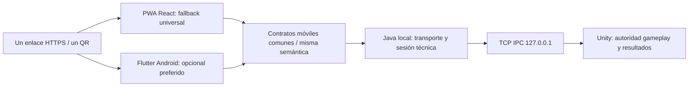

# Rediseño Incremento 3 — HTTPS y onboarding común PWA / Flutter Android

**Estado de arquitectura objetivo: aprobada conceptualmente por PO.** Estrategia operativa Proposed; [evaluación de viabilidad3A](PHASE0_PHONE_3A_FEASIBILITY.md) pendiente de aprobación antes de adaptar#94.
**Requisito de producto de dos clientes: Accepted**, por instrucción explícita del PO.
Base integrada: develop `ec5880c94304e8c7d587c5f5d8c2cf28dbf5a760`.
[PR #94](https://github.com/Josue1855/Gorilla-Escape/pull/94) permanece DRAFT: su solución
CA local/SAN IPv4 requiere configuración del teléfono y **no cumple el nuevo gate3A**.
Ningún código se modifica por este rediseño; no se implementa Flutter ni otro incremento.
La precisión presente sustituye la estrategia TLS de [diseño anterior](PHASE0_PHONE_LAN_ONBOARDING_DESIGN.md)
y su [procedimiento CA](PHASE0_PHONE_3A_VALIDATION.md); ambos se conservan como historial.

## 1. Producto y experiencia

Dos clientes oficiales del mismo producto:

- **PWA/web:** participación universal sin instalación obligatoria. Android/iPhone pueden
  usar navegador; la app Flutter no es condición de acceso ni alternativa a HTTPS seguro.
- **Flutter Android:** cliente nativo opcional, preferido por el jugador cuando instalado.
  Acceso futuro a sensores, hápticos, audio, pantalla completa, lifecycle, reconexión y
  feedback local podrá mejorar la experiencia; esos beneficios aún no están medidos ni
  implementados y no autorizan adelantar4C.

Mínimo: conectarse a la red → escanear el único QR → abrir página → participar por web.
Con app disponible: abrir Gorilla Escape o elegir «Abrir en Gorilla Escape» y usar el
mismo enlace/contexto. Siempre conservar ruta web utilizable y respetar elección del
jugador/OS. Nunca pedir instalar certificados/CA/perfiles TLS, cambiar DNS/configurar
navegador o instalar Flutter. Preparación del host/red compete al operador, no al jugador.

## 2. Un sistema, dos adaptadores de cliente

Java es un único backend y registro técnico de conexión. Unity sigue propietario del
estado jugable, física, scoring, GP, ganador y resultados; no segundo torneo en Java ni
reglas competitivas en Dart/JS. PWA y Flutter son adaptadores de input y feedback.

Compartir versión de contrato, sesión, IDs, secuencia/timestamps/errores y estados de
conexión. Fuente de verdad futura `Shared/Protocol`, fixtures comunes y tests de conformidad
Java/JS/Dart; lenguajes requieren codecs distintos, no diseños de protocolo diferentes.
No reutilizar el parser acotado IPC C# como parser móvil ni cambiar envelope SENSOR sin
aprobación. Flutter no abre TCP IPC ni conoce su launch token.

Backend asigna/reconoce identidad técnica canónica con las mismas reglas para ambos
clientes. `clientKind=web|android` puede ser metadata de capacidades, nunca otro namespace
sessionId/playerId ni otra autoridad. Browser y app no comparten automáticamente storage:
no afirmar que un deviceId local demuestra identidad de teléfono físico. Migración entre
clientes requerirá handoff explícito/versionado y confirmado por Java para evitar dos
plazas/conexiones activas; diseñarlo en4C, sin inventar jugadores ni secretos persistentes
en QR ahora. Cambiar cliente no borra/recalcula resultados Unity.

## 3. Nueva estrategia HTTPS propuesta para 3A

**Recomendar FQDN bajo dominio controlado + certificado público confiable mediante
DNS-01 + Java HTTPS directo en LAN.** Certificado para hostname, no IP privada. Separar
binding IPv4 local de identidad TLS/URL. El jugador no instala trust material.

| Opción | Decisión de diseño |
|---|---|
| CA local/mkcert + SAN IPv4 | Ya no cumple producto; no aceptar #94 con ese gate |
| HTTP privado o ignorar advertencias TLS | Rechazado; no asegura contexto seguro |
| Flutter con CA privada embebida | No resuelve fallback PWA; no usarlo como escape |
| Dominio controlado + certificado público + LAN | Recomendado, con preparación operativa y prueba física |
| Proxy/túnel cloud obligatorio durante partida | Fuera: añade dependencia runtime de Internet |

DNS-01 verifica control del dominio y permite emitir sin publicar el servidor de juego
para conexiones entrantes desde Internet. Requiere acceso previo al proveedor DNS/CA;
no abrir puertos WAN ni UPnP. [Let's Encrypt, desafíos](https://letsencrypt.org/docs/challenge-types/).
Los nombres/IP reservados no sirven como identidad pública certificable; usar SAN DNS
real bajo control del operador. [Política ISRG](https://letsencrypt.org/documents/ISRG-CP-v1.3.pdf).

Preparación propuesta:

1. Operador identifica dominio autorizado, proveedor DNS y subdominio único de estación,
   por ejemplo `pc01.play.<dominio-controlado>` (conceptual, no dominio existente).
2. Emitir/renovar certificado público DNS-01 antes de la demo. CA/credenciales DNS/private
   key sólo en host de preparación; leaf/chain/keystore/password fuera de Git/JAR/PWA/logs.
   No instalar nada en teléfonos. Vigencia/chain/reloj válidos y renovación monitoreada.
3. Router/red de demo reserva IPv4 de PC y resuelve FQDN a esa dirección mediante DNS LAN
   entregado normalmente por DHCP. Operador configura red, sin cambios DNS del jugador.
   A público hacia IP privada puede ayudar a resolver cuando hay WAN, pero no garantiza
   funcionamiento offline y puede activar filtros de rebinding; no usarlo como único gate.
4. Java escucha una IPv4 LAN explícita, sirve assets/API y TLS con SAN DNS exacto; IPC
   continúa exclusivamente127.0.0.1. Sin segundo backend/Vite/reverse proxy/conector HTTP.
5. Proponer HTTPS **443** para origen estándar y futura asociación Android; cambia la
   propuesta8443, no se cambia código. En Linux requiere resolver permisos de bind de
   forma acotada al servicio, sin ejecutar todo Java como root ni otorgar capacidad global
   al binario compartido. Selección de launcher/permiso operativo requiere revisión antes
   de aprobar implementación. No instalar reglas ni capacidades ahora.

Sin WAN durante juego exige **resolución del nombre offline**, no sólo cache PWA. Probar
primera carga sin cache en teléfonos nuevos a la LAN. DNS privado estricto/DoH de un
jugador puede depender de WAN y no obedecer DNS DHCP: no pedirle desactivarlo ni declarar
compatibilidad universal offline de cualquier configuración. Es un riesgo real del gate.
Verificar red/Android/Chrome e iPhone/Safari de referencia sin modificaciones del jugador;
si fallan, registrar bloqueo y volver al PO, no reinstalar CA ni relajar TLS. Router no
controlado/AP isolation también puede impedir demostrar la propuesta.

Internet para emisión/renovación/preparación no es Internet obligatorio durante gameplay.
Caducidad, falta de dominio o resolución LAN offline impiden PASS de3A; no prometer HTTPS
sin certificados confiables, sin dominio y sin setup de red al mismo tiempo. No renovar
certificados mágicamente offline ni considerar cache del navegador sustituto de PKI/DNS.

## 4. Un enlace y un QR, neutrales respecto al cliente

Formato conceptual propuesto, todavía sin contrato implementado:

`https://pc01.play.<dominio-controlado>/join?v=1&sessionId=<identificador-efimero>`

URL HTTPS normal que siempre tiene representación web. Java debe servir `/join` y sus
assets en3B, con fallback web válido para navegaciones conocidas, nunca `/api`→shell.
La ruta real sustituye el fragmento `/#join` propuesto anteriormente: facilita reglas
App Links y parsing equivalente JS/Dart. No fijar UUID, expiración o parámetros finales
antes de cerrar contrato3B. QR único, sin formato Flutter, schemes personalizados como
ruta principal, launch token IPC, credenciales ni secretos persistentes. Queries deben
sanitizarse en logs/referrers; el sessionId público no es autenticación.

PWA valida versión/servidor/sesión con Java; Flutter deberá ejecutar la misma validación,
no confiar sólo en URL ni extraer un endpoint arbitrario para enviar input. Allowlist de
origen/esquema/hostname y routing deben diseñarse en4C contra enlaces maliciosos.
Sesión técnica efímera3B no es GameSession competitivo. Su duración/IDs/errores/capacidad
son iguales para ambos clientes, sin depender de cookies web, user-agent o instalación.
Handoff posterior puede añadir ticket corto/single-use fuera del QR universal, con
semántica común y sin duplicar negocio; no se implementa ahora.

## 5. App Links / apertura opcional Flutter

Diseño futuro4C: Android intent filters HTTP(S) del dominio controlado y
`https://<hostname>/.well-known/assetlinks.json`, con packageName y fingerprint público
del certificado de firma. Java/operador deben servir documento correcto HTTPS sin
redirect, hostname consistente y acceso en el origen estándar previsto. Flutter consume
el mismo enlace por routing nativo. No añadir librería/deep link code ahora.
[Android: verificación](https://developer.android.com/training/app-links/verify-applinks),
[Flutter: deep linking](https://docs.flutter.dev/ui/navigation/deep-linking).

Instalar app no garantiza verificación inmediata ni que OS abra automáticamente la app.
Dominio sólo accesible en LAN puede no verificarse al instalar fuera de esa LAN; offline
first install/verificación también requiere prueba. Definir como preparación del operador
la publicación/asociación accesible cuando haga falta, sin convertir cloud en transporte
ni dependencia de la partida. No afirmar universalidad de asociación LAN sin evidencia.

Sin app, asociación fallida o preferencia de navegador: continuar PWA, sin store obligatorio
ni cambio de ajustes. Con app, botón explícito «Abrir en Gorilla Escape» y apertura manual
desde launcher son rutas posibles. La app debe permitir retornar al flujo web; mecanismo
exacto que evita reabrirse depende de reglas/versiones Android y se valida en4C. No timers
para adivinar instalación, auto-redirecciones en bucle ni segundo QR. App Links es mejora
de routing, no autorización de sesión ni otro transporte.

## 6. Roadmap y neutralidad

| Bloque | Alcance diseñado | Gate / neutralidad |
|---|---|---|
| 3A | LAN/HTTPS sin configurar teléfonos, assets JAR, health | Trust público, FQDN/resolución offline, Android+iPhone físicos; no QR/sesión/Flutter |
| 3B | QR universal, sesión técnica y registro HTTP | IDs/errores/versiones independientes de browser; nunca requerir instalación |
| 4A | WSS/WebSocket + Gorilla Protocol móvil común | Una fuente Shared, validación Java, mismas reglas de conexión/cancelación/sequence |
| 4B | Sensores PWA reales | Permisos/tasas medidos en browser físico; no inferir50Hz universal |
| 4C | Flutter Android con mismo protocolo | App opcional, mismo WSS/IDs/backend, App Links/handoff y paridad de mensajes |
| Posterior | Comparación/hardening de ambos | Métricas separadas, lifecycle/reconnect/feedback, compatibilidad y límites reales |

WSS es preferencia inicial para ambos. No UDP exclusivo Flutter. Si mediciones posteriores
justifican transporte distinto, proponer adaptador conservando mismo modelo/semántica y
autoridad, con decisión explícita, no dos sistemas de sesión/scoring.

Mantener neutrales en3A/3B: trust público compartido, origen y API versionados, contrato
Shared y fixture común, sesión técnica común, IDs no ligados al cliente, errores visibles,
capability negotiation opcional, expiración validada en servidor, endpoints ajenos a
GameState. No preconstruir sensores/lógica Dart ni usar APIs web como definición de negocio.

## 7. Pruebas futuras y aceptación del rediseño

3A: Android Chrome/iPhone Safari sin CA/perfil/DNS/browser mods, URL FQDN SAN correcto,
HTTPS confiable/secure context, primera carga sin cache y sinWAN, SW/refresh/reapertura,
health real Java, cierre limpio y IPC inaccesible desde segundo equipo LAN. Tests con CA
efímera siguen útiles para unidades TLS, **no prueban trust público del producto**.

3B: QR físico único siempre abre PWA; validación de sesión/versión/errores, expiración y
presencia técnica real. 4C añadirá pruebas misma sesión/IDs entre clientes, app instalada/
ausente/asociación fallida, cold/warm start, elección web, handoff sin duplicados y WSS
común. Mocks/simuladores nunca sustituyen teléfonos. No extrapolar onboarding a gameplay.

**Decisiones técnicas pendientes de PO:** dominio/control/proveedor y coste/preparación;
router/red oficial y DNS offline sin ajustes en jugadores; certificado público/renovación;
puerto443 y permiso de bind acotado; hospedaje/verificación futura assetlinks; gate físico
realista frente a DNS privado/DoH. No comprar dominio ni cambiar red/código en esta tarea.

## 8. Estado y límites

Producto dual-cliente Accepted; rediseño técnico Proposed. #94 DRAFT, estrategia CA anterior
superada y pendiente de sustitución aprobada; 3A IN PROGRESS / nuevo gate NOT RUN, 3B/4A/
4B/4C NOT STARTED; Incremento3/Fase0 IN PROGRESS; Incremento2 PASS/MERGED; Fase1 NOT STARTED.
No Flutter implementado ni nuevo transporte, sensores, cámara, gameplay o resultados.
