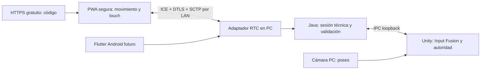

# Decisión técnica: PWA segura, movimiento y transporte local

## Estado vigente — FINAL PHASE0 AUDIT, 2026-10-08

**PHASE 0 FINAL AUDIT: PASS — SOFTWARE/LAB.** Fase0 — Base/Spike: **COMPLETED — SOFTWARE/LAB**. Fase1 — Gorilla Smash Vertical Slice: **READY TO START**, no iniciada. Physical validation debt remains open and is required before final MVP acceptance. 3A product/physical onboarding: **DEFERRED / IN PROGRESS**. #94 **OPEN/DRAFT**; candidato local sin commit distinto del PR remoto. Sin nuevo código de producto, commit/push/merge ni fase posterior. [Audit y DoD](PHASE0_FINAL_AUDIT.md), [evidencia](evidence/phase0-final-audit-2026-10-08/gate-summary.json). Los estados previos siguientes son snapshots históricos.

> **Lectura de estado (auditoría 2026-10-08):** las fechas, estados y próximos pasos de este documento son snapshots históricos del incremento descrito. El estado consolidado vigente se registra en [PHASE0_FINAL_AUDIT.md](PHASE0_FINAL_AUDIT.md). Las decisiones de transporte anteriores están **superseded / replaced by DEC-010 Mobile Transport**; se conservan resultados y limitaciones originales.

**Accepted únicamente como base de Spike por el Product Owner; transporte definitivo NO aprobado — 6 de octubre de 2026, America/Chihuahua.** Investigación y auditoría; sin implementación ni pruebas físicas nuevas. PR #94 verificado OPEN/DRAFT, head `0d940f77f533bb6780bc3f07169dce414ea21e54`. 3A IN PROGRESS; posteriores NOT STARTED.

El PO exige paridad semántica web/Flutter e Input Fusion. HTTP LAN táctil como arquitectura final queda rechazado. La [propuesta anterior](PHASE0_PORTABLE_LAN_REDESIGN.md) conserva su análisis histórico. Las propuestas de ejecución siguientes no autorizan incorporación al producto, hosting ni infraestructura. La corrección de producto sobre cámara PC es normativa; el transporte sigue pendiente de decisión.

## Recomendación y concesión necesaria

Investigar **PWA HTTPS estática gratuita previamente preparada → transporte LAN cifrado dentro de Java → IPC loopback → Unity**. Comparar WebTransport y WebRTC mediante los dos Spikes aislados de [este plan](PHASE0_SECURE_MOTION_SPIKE_PLAN.md). Priorizar el ensayo de WebTransport para falsar pronto la hipótesis de un único QR; no seleccionarlo por esa hipótesis. WebRTC es alternativa real, no ganador por soporte histórico. No mantener dos stacks productivos anticipadamente.

El hosting público sólo entrega código y actualizaciones. No recibe sesiones, sensores, gameplay o resultados. La PWA participa en movimiento, orientación y touch cuando hardware, navegador, permisos y mecánica lo permitan. Flutter ofrece las mismas señales semánticas con APIs nativas; no es el único cliente de movimiento.

**Concesión mínima propuesta:** cada teléfono debe poder cargar y preparar la PWA inicialmente mediante Internet. Después podrá funcionar sin WAN si conserva el bundle/SW y pasa la negociación local. No exige instalar PWA, Flutter, CA o perfiles, pero sí preparación previa verificable. Esta concesión requiere decisión explícita del PO.

Un teléfono nuevo, sin haber cargado nunca la PWA, sin Internet, sin aplicación instalada, sin CA y sin origen HTTPS local confiable **no puede obtener una PWA con sensores web mediante un flujo portable de navegador stock**. HTTP y QR no autentican ese origen. RTC y WebTransport transportan datos después de cargar código; no resuelven la confianza de la primera página. El pinning de WebTransport tampoco permite navegar una página HTTPS no confiable. Localhost de la laptop no es localhost del teléfono.

Para ese teléfono hay que conceder acceso inicial online, preparación previa o una forma de servir HTTPS local confiable. La app opcional no resuelve el caso web/iPhone. No se restablece dominio propio, DNS personalizado o instalación de CA como obligación.

## 1. Opción A: origen HTTPS público gratuito

GitHub Pages es un ejemplo compatible con el requisito económico: HTTPS bajo `https://<cuenta>.github.io/<proyecto>/`, Pages en repositorios públicos con GitHub Free. Visibilidad, términos, límites, cuenta del operador y autorización de publicación deben revisarse; no publicar ni activar hosting ahora. [GitHub Pages HTTPS](https://docs.github.com/en/pages/getting-started-with-github-pages/securing-your-github-pages-site-with-https).

Flujo propuesto:

1. Primera visita HTTPS online, en contexto top-level.
2. Instalar/activar SW y precachear el bundle completo, incluidos chunks y recursos requeridos.
3. Verificar una versión completa; no considerar «abrió una vez» suficiente.
4. Reabrir la misma URL HTTPS sin WAN y comprobar shell, permisos y recursos.
5. Incorporarse al host PC mediante señalización y transporte locales.

La URL conserva su origen HTTPS cuando el SW sirve recursos almacenados. No redirigir al origen HTTP de la laptop para obtener sensores. Instalar en Home Screen es opcional, no requisito. [Service Workers](https://github.com/w3c/ServiceWorker/blob/main/explainer.md), [Secure Contexts](https://www.w3.org/TR/secure-contexts/).

La caché puede desaparecer por presión de almacenamiento, limpieza o política del navegador. No garantizar persistencia por registrar SW ni por pedir almacenamiento persistente. Probar Safari/Chrome con reapertura, cierre del navegador, reinicio del teléfono, cache ausente y rutas/fragments de incorporación. [WebKit storage policy](https://webkit.org/blog/14403/updates-to-storage-policy/).

Versiones: buildId y bundle atómico; compatibilidad con Java; no activar actualizaciones durante una sesión. Preparación y actualizaciones requieren conectividad previa. Si falta el shell, la UI propia ni siquiera podrá mostrar el bloqueo: la PC debe explicar la necesidad de preparación online. Sin CDN obligatorio ni analytics. SDP, tokens e input nunca se envían al hosting; fragmentos consumidos se eliminan y no se registran.

**A sola no basta:** HTTPS público → HTTP/WS LAN afronta mixed content y políticas LNA. CORS no establece confianza TLS; WebSocket no permite aceptar certificados arbitrarios mediante un pin en JavaScript. Hace falta B o una variante C realmente probada.

## 2. Movimiento en Android e iPhone; cámara de gameplay exclusivamente PC

| Cliente | Acceso diseñado | Prueba pendiente |
|---|---|---|
| Android Chrome | HTTPS top-level; DeviceMotion/Orientation; solicitar permiso si la API lo requiere; comprobar campos y eventos reales | Hardware, versión, políticas, campos nulos y frecuencia efectiva |
| iPhone Safari | HTTPS top-level; botón de usuario para solicitar motion/orientation mediante requestPermission cuando disponible; estado granted/denied explícito | Eventos reales, permisos offline, reapertura y frecuencia/campos por dispositivo |
| Ambos | Touch/gestos, audio tras gesto y hápticos cuando estén disponibles | HTTPS no garantiza permiso ni hardware; background/screen lock puede suspender señales |

Fuentes: [W3C Motion/Orientation](https://www.w3.org/TR/orientation-event/), [WebKit permiso por interacción](https://bugs.webkit.org/show_bug.cgi?id=201676), [Media Capture](https://www.w3.org/TR/mediacapture-streams/). No depender de Generic Sensor para paridad Safari; no iframe externo, flags, permisos ficticios o CA instalada. No pedir cámara/micrófono sólo para cambiar la política ICE.

Permiso denegado o dato ausente se declara. Touch es alternativa de accesibilidad cuando la mecánica lo permita, no prueba de movimiento PASS. La cámara del teléfono queda excluida del gameplay y de Input Fusion: no capturar/transmitir vídeo ni pedir ese permiso para postura o gestos corporales. El lector QR del sistema y un futuro scanner Flutter sólo sirven para emparejar. Input Fusion combina webcam PC, sensores móviles y touch.

## 3. Opción B: WebRTC DataChannel directo a PC

DataChannel transporta SCTP sobre DTLS e ICE. Cifra el canal y puede autenticar al peer mediante fingerprint DTLS recibido por señalización autenticada, sin CA pública para la PC. [RFC 8835](https://www.rfc-editor.org/rfc/rfc8835.html), [RFC 8827](https://www.rfc-editor.org/rfc/rfc8827.html).

Una LAN alcanzable puede negociar con candidatos host sin servidores STUN/TURN externos. Los checks ICE usan mensajes STUN entre peers: no confundirlos con dependencia de un servidor público. Privacidad del navegador, ofuscación/mDNS, permisos y filtrado pueden limitar candidatos/rutas. mDNS no requiere configurar DNS del router, pero su resolución no está garantizada en toda red. Probar DataChannel-only, sin permiso de cámara, en Chrome y Safari. [WebRTC](https://www.w3.org/TR/webrtc/), [RFC 8828](https://www.rfc-editor.org/rfc/rfc8828.html), [WebKit WebRTC](https://webkit.org/blog/7763/a-closer-look-into-webrtc/).

Aislamiento de clientes, VPN o bloqueo UDP pueden impedir la conexión. TURN remoto sería una dependencia WAN y queda fuera del baseline offline. Hotspot sólo exige LAN/DHCP/ruta compatibles, pero requiere prueba por SO/driver y autorización antes de cambiar conexiones. Si no existe ruta entre peers, mostrar bloqueo; no prometer que ICE atraviesa cualquier red.

Diseño de canales pendiente de prueba: control/calibración fiables y ordenados; muestras con política de frescura/retransmisión limitada para evitar input antiguo. Límites de bufferedAmount, edad y buffers; no perder silenciosamente eventos de botones. Medir adquisición, envío y fusión por separado. El objetivo 50 Hz no garantiza sensores a 50 Hz. Medir RTT, gaps, jitter y móvil→Unity; separar tiempo de incorporación.

### Implementación del peer PC: decisión pendiente

Java/Spring actual no contiene ICE/DTLS/SCTP/WebRTC. No es una extensión trivial de WebSocket. Hará falta una biblioteca/adaptador auditado: licencia, mantenimiento, binarios Windows/Linux/macOS, memoria, puertos, interfaz y cleanup. No se selecciona ni instala dependencia ahora.

Un peer en navegador PC puede servir como referencia para un spike autorizado: código local en HTTP loopback y bridge autenticado sólo loopback→Java. **Añade un tercer runtime**, con lifecycle/background/puertos propios; no se adopta silenciosamente como solución final. Preferencia final: adaptador dentro de Java si viable; auxiliar supervisado sólo si se justifica. No añadir Electron, Node o un servicio cloud por defecto. El adaptador nunca adquiere autoridad de juego.

## 4. Señalización offline por QR

WebRTC no define el canal de señalización. Un sessionId corto no reemplaza el intercambio de offer/answer/ICE si no existe otro canal.

Propuesta de referencia, NO adoptada como UX:

1. PC crea oferta DataChannel-only, espera fin/deadline de gathering y mantiene vivo el peer.
2. Muestra QR con oferta, versión, sesión, nonce, expiración y fingerprint. PWA segura preparada recibe el contexto mediante URLfragment o scanner HTTPS.
3. PWA crea respuesta con candidatos y muestra QR de vuelta.
4. Webcam/scanner local PC captura respuesta; valida tamaño, sesión, nonce, expiración y uso único. Operador confirma plaza.
5. ICE → DTLS → DataChannel → handshake del protocolo y admisión Java.

La pantalla física correcta y el teléfono presente autentican el intercambio frente a sustitución en LAN. No protege una pantalla QR suplantada ni observadores físicos. Firmar el QR con una clave incluida en ese mismo QR no añade identidad externa. No incluir token IPC o clave privada. Credenciales ICE/SDP son efímeras sensibles; no publicarlas ni guardarlas en evidencia bruta.

Viabilidad de estándares no equivale a viabilidad de UX: la oferta/respuesta puede no caber en un QR. Capacidad depende de versión, encoding y corrección. Medir payload real, luz, distancia y lectura en ambas direcciones; no prometer compresión suficiente. Si exige segmentación, reensamblaje acotado y deadline requieren revisión. [DENSO: capacidad QR](https://www.qrcode.com/en/about/version.html).

Latencia de incorporación aún NO MEDIDA. Separar apertura, permisos, gathering, lectura de ambos QR, ICE, DTLS y admisión. Ensayar 1–4 jugadores y reintentos. Necesita webcam/scanner en PC; su uso inicial no debe competir con tracking posterior. El lector de QR del sistema puede no aceptar una URL larga: prueba pendiente. No adoptar todavía QR bidireccional.

Retorno por HTTP LAN puede mejorar UX, pero afronta LNA/mixed content y MITM de señalización. No denominarlo seguro sin autenticación fuera de banda o cifrado auditado; no inventar criptografía para ahorrar un escaneo. Señalización online opcional no sería gameplay cloud, pero sí agrega servicio/WAN inicial: fuera del baseline completamente local.

## 5. Opción C: APIs modernas LAN

| Tecnología | Evidencia consultada | Decisión provisional |
|---|---|---|
| LNA/fetch | Chrome documenta permisos público→local y excepciones mixed content; WebKit tiene cambios relacionados | No cifra HTTP ni autentica host; Safari físico obligatorio |
| WS + targetAddressSpace | WICG consultado no ofrece RequestInit equivalente en constructor WS; no inferirlo de fetch | No base portable ni API de pin de certificado; soporte concreto por verificar |
| WebTransport + serverCertificateHashes | W3C define pin; Safari 26.4 añadió WebTransport; main de WebKit contiene hash/vigencia | Candidato serio; no concluir pinning en una release/iPhone por leer código main |
| WebRTC | Chrome/Safari y DTLS/DataChannel documentados | Candidato comparado; LAN/offline/peer Java y UX aún no probados |

[Chrome LNA](https://developer.chrome.com/blog/local-network-access), [WICG LNA](https://wicg.github.io/local-network-access/), [guía Google actual](https://github.com/GoogleChrome/modern-web-guidance/blob/main/skills/modern-web-guidance/guides/security/local-network-access.md). No trasladar flags de ejemplos a producto.

WebTransport podría evitar offer/answer: PWA HTTPS → endpoint QUIC LAN → pin de certificado efímero entregado por QR → adaptador Java. Requiere stack HTTP/3/QUIC/WebTransport: Spring HTTPS8443 no lo implementa. Comparar dependencia y soporte Windows/Linux/macOS, Origin/admisión, firewall UDP, backpressure y datagramas. No prometer fallback HTTP/2 portable ni pin por detectar window.WebTransport.

El borrador W3C consultado exige conexión dedicada, SHA256, certificado vigente con validez ≤2 semanas y algoritmos permitidos; ECDSA P-256 es base interoperable, RSA está excluido. El hash autentica servidor, no cliente. [W3C WebTransport](https://www.w3.org/TR/webtransport/). [Safari 26.4](https://webkit.org/blog/17862/webkit-features-for-safari-26-4/), [código main de WebKit](https://raw.githubusercontent.com/WebKit/WebKit/main/Source/WebKit/NetworkProcess/webtransport/cocoa/NetworkTransportSessionCocoa.mm).

Hacer comparación física acotada antes de congelar transporte: si WT/pin pasa ambos teléfonos con menor coste host/UX, recomendar cambiar a WT. No implementar dos stacks productivos anticipadamente. Fingerprint erróneo debe fallar; no basta probar conexión exitosa.

## 6. Escenarios sin Internet

| Escenario | Resultado propuesto |
|---|---|
| Teléfono nuevo con acceso inicial online | Carga HTTPS y preparación; posterior LAN offline por transporte probado |
| PWA preparada y recursos/SW conservados | Posible movimiento/transporte offline; verificar reapertura y permisos reales |
| Caché eliminada/incompleta y sin WAN | BLOCKED; no esconderlo con HTTP táctil |
| Nunca abrió PWA, sin Internet/origen local confiable/app | Combinación incompatible con web segura portable; necesita concesión |
| LAN aislada o hotspot imposible | BLOCKED de ruta; otra red permitida, no TURN obligatorio |
| Sensor denegado/ausente | Capacidad declarada; alternativa de mecánica, no sensores PASS |

Cambiar el gate antiguo «primera carga sin WAN en teléfono nuevo» a «preparación online + reapertura e incorporación sin WAN» necesita aprobación. No reinterpretar resultados históricos. El hosting gratuito pasa a ser dependencia de preparación/versionado, no de partida. Prueba de laboratorio aislada distingue datos celulares de LAN; después repetir configuración stock, sin exigir ajustes de seguridad del jugador.

## 7. Contrato conceptual común

Shared/Protocol y fixtures futuros Java/JS/Dart, con codecs propios y la misma semántica. No extender el parser específico IPC. No fijar wire format, tasa o unidades canónicas sin cotejar APIs.

| Grupo | Conceptos y reglas |
|---|---|
| Identidad | protocolVersion, sessionId, playerId, connectionEpoch, sequence, clientKind; Java asigna/admite, no confiar en IDs autodeclarados |
| Tiempo | Timestamp monotónico de adquisición, clockDomain/epoch y recepción PC; mapping con offset/incertidumbre; no restar relojes distintos directamente |
| Orientación | Quaternion o representación declarada, ejes/frame/screenRotation/referencia relativa-absoluta; transformación versionada |
| Aceleración | XYZ, linearAcceleration y accelerationIncludingGravity separados, disponibilidad/unidad/fuente |
| Gravedad | Vector opcional, measured/derived y método/calidad; ausente no es cero |
| Giro | Rotation rate/gyroXYZ con unidad/ejes; no asumir que evento web equivale a gyro raw nativo |
| Touch/gestos | Pad, pointers, botones/edges/gestos; cancelación neutral y secuencia |
| Calibración | calibrationId/revision/status/referencia neutral; Unity valida estado aceptado |
| Capacidades/calidad | supported/granted/active, campos disponibles, intervalos reales/gaps/stale/saturación; confidence desconocida si API no la ofrece |
| Perfiles | profileId/revision/playerId/minigameId, preferencias y capacidades feedback; evitar sensibilidad aplicada dos veces |

APIs web expresan aceleración en m/s² y giro en grados/s; orientación tiene convención Euler específica. Comparar ejes/unidades con APIs nativas antes de canonicalizar; quaternion requiere conversión verificada. Gravedad no equivale al vector accelerationIncludingGravity, y muestras asíncronas no se restan sin tratamiento explícito. [W3C Motion/Orientation](https://www.w3.org/TR/orientation-event/). Flutter plugins/unidades se investigarán al seleccionar APIs. Campos ausentes no se inventan; recibir un evento no demuestra confidence=1.

Perfiles por jugador y minijuego: sensibilidad, mano dominante, inversión de ejes, zona muerta, intensidad, neutral, accesibilidad, giro, hápticos y audio. Unity posee parámetros que afectan física competitiva y su revisión; Java transporta/valida, clientes ejecutan feedback y preprocesado declarado. No UI final ahora. Cambios y calibración deben tener versiones/límites; no modificar una tirada en curso sin política explícita.

## 8. Cámara PC + móvil: ejemplo boliche

Cámara PC → poses/trayectoria con playerId, tiempo y calidad; móvil web o Flutter → aceleración, giro, orientación, touch, calibración y perfil → Java → Unity. Unity normaliza, alinea tiempo, calibra y fusiona las señales.

**Sólo Unity determina velocidad, dirección, potencia, rotación, chanfle/hook y resultado físico.** Java/React/Flutter no calculan scoring ni física oficial. Antes de fusión: mapping de relojes, ventanas, stale/reorder, ausencia de fuente y revisión de calibración. No reconocimiento facial ni vídeo almacenado/enviado a cloud. Sólo la webcam integrada/externa PC participa en detección corporal; cámara móvil excluida. Véase [Input Fusion conceptual y boliche zurdo](PHASE0_INPUT_FUSION_CONCEPT.md).

Web y Flutter tienen el mismo potencial semántico; hardware/permisos limitan capacidades concretas. El contrato no impone web básica frente a app real. Validar mensajes no demuestra honestidad de todo sensor; autoridad y límites permanecen en Unity.

## 9. Clasificación de #94

La auditoría concreta de fuentes, evidencia, SW y configuración está consolidada en [§14](#14-auditoría-de-continuidad-y-candidato-94): reutilizable, histórico, pendiente de adaptación y descartado conceptualmente. No borrar código por reclasificar una decisión. React actual es diagnóstico, no captura sensores; Java actual no contiene RTC/WT. Todos los resultados anteriores conservan su alcance.

## 10. Roadmap revisado para aprobación

1. Decidir concesión de primera carga online y autorizar hosting/spikes/dependencias pertinentes.
2. **3A-S:** PWA HTTPS, bundle/SW verificables; Android e iPhone con sensores reales y reapertura offline. Webcam PC sólo en ensayo posterior autorizado separado; nunca cámara móvil para gameplay.
3. **3A-T:** comparación WT/pin y RTC LAN/hotspot; retorno de señalización local; medir y elegir un transporte. Peer PC de prueba clasificado explícitamente.
4. **3B:** QR/sesión/admisión/1–4 plazas y UX medida; nuevo teléfono online y preparado offline separados.
5. **4A:** Gorilla Protocol de movimiento, tiempo, touch, calibración, perfiles y calidad; codecs/fixtures y límites hasta Unity, sin gameplay.
6. **4B:** movimiento web/lifecycle sostenido en ambos navegadores, campos/tasas/permisos reales.
7. **4C:** Flutter con paridad de sesión/semántica, capacidades y transporte seguro.
8. Bloques posteriores propuestos de Fase0, sujetos a autorización: cámara PC/poses, sincronización, Input Fusion y ensayo de boliche separado; personalización/calibración conceptual.
9. Fase1/minijuegos/UI final de personalización sólo tras gate y autorización, con física/scoring en Unity.

Ningún bloque se inicia por publicar este roadmap. No implementar QR, sensores, cámara, gameplay o Flutter en esta tarea.

## 11. Riesgos y criterios de aceptación futuros

Riesgos: hosting gratuito/términos/disponibilidad, cache eviction, campos/ejes/permisos distintos, mDNS/UDP/VPN/aislamiento, UX QR, binarios RTC/QUIC y runtime extra, pinning Safari released sin probar, reloj/expiry, suspensión y suplantación física del QR. Ninguna documentación equivale a PASS físico.

Gates propuestos: ambos teléfonos identificados; contexto HTTPS; permisos granted/denied separados; muestras reales de aceleración/giro/orientación y semántica cotejada; nuevo teléfono online y preparado offline después de reapertura/reboot; versión atómica/compatibilidad; rutas locales verificadas sin TURN/STUN públicos necesarios; certificados/fingerprints erróneos rechazados, replay/expiry/admisión; bytes/lectura/tiempo QR real; métricas por plataforma/transporte con gaps/edad/buffers, 1–4 clientes y cleanup; trazabilidad hasta Unity. No extrapolar RTT IPC a móvil→gameplay.

Decisiones pendientes del PO: concesión inicial online, gate offline nuevo, hosting estático y alcance de spikes; peer PC/dependencia; RTC o WT según evidencia; UX de señalización y presupuesto de incorporación medido. No hay recomendación de dominio comprado, CA instalada, router especial, DNS del jugador o backend gameplay cloud.

**Respuestas directas:** secure context por HTTPS gratuito y caché preparada; sensores Android/Safari por APIs y consentimiento; input por canal local cifrado y adaptador; router/hotspot sólo necesitan conectividad real; sin Internet funciona la PWA previamente preparada si conserva recursos; teléfono nuevo necesita concesión inicial; Flutter conserva paridad; webcam PC y sensores móviles se fusionan en Unity; recomendación de arquitectura A con transporte B/C pendiente de Spike; la combinación de teléfono nuevo offline sin origen confiable no cumple web segura portable.

3A IN PROGRESS; pruebas físicas NOT RUN; #94 OPEN/DRAFT; posteriores NOT STARTED; Fase0 IN PROGRESS; Fase1 NOT STARTED. Base Accepted para Spike; ejecución propuesta y transporte final pendientes de aprobación.

## 12. Respuestas explícitas a las veinte preguntas del PO

Estas respuestas distinguen estándares/documentación consultados de pruebas locales. No hubo nuevos prototipos ni ejecución física. [Plan comparativo, bibliotecas, métricas y gates](PHASE0_SECURE_MOTION_SPIKE_PLAN.md); [contrato e Input Fusion](PHASE0_INPUT_FUSION_CONCEPT.md).

| # | Pregunta | Respuesta / condición |
|---|---|---|
| 1 | Contexto seguro PWA | Hosting estático HTTPS gratuito candidato; SW y bundle deberán prepararse/verificarse antes de uso offline. Ese gate público/físico NOT RUN; publicación no autorizada. El pin WT autentica transporte, no la navegación inicial. |
| 2 | Sensores Android Chrome | DeviceMotion/Orientation en HTTPS top-level, consentimiento requerido por la versión y campos reales; medir hardware/frecuencia, no inferir de la interfaz. |
| 3 | Sensores iPhone Safari | Botón con interacción para requestPermission cuando disponible; granted/denied y eventos efectivos. Modelos/versiones y comportamiento offline NOT RUN. |
| 4 | Movimiento hacia PC | Mensajes normalizados → canal WT o RTC cifrado → Java → IPC local → Unity. Ningún resultado competitivo calculado por el teléfono. |
| 5 | Transporte conveniente | Indeterminado hasta interop, autenticación, UX, licencia y lifecycle reales. Ensayar WT primero por onboarding, RTC en comparación independiente. |
| 6 | Router especial | No requerido si hay ruta directa entre PC y teléfonos. Aislamiento/UDP bloqueado pueden impedir ambos candidatos. |
| 7 | Hotspot | Posible condicionado a SO, driver, arranque sin WAN y ruta. No demostrado en Windows/Linux ni en teléfonos de referencia. |
| 8 | Internet inicial | Cargar shell, assets y SW; futuras actualizaciones. Obtener bibliotecas/modelos del operador previamente. No signaling cloud obligatorio. |
| 9 | Sin WAN posterior | Shell preparado, sensores permitidos, transporte LAN y backend local; únicamente después de pruebas físicas. Caché conservada es condición. |
| 10 | Teléfono nunca preparado | BLOCKED sin WAN ni origen local confiable. Concesión mínima: primera carga online/preparación previa; pendiente aprobación explícita del PO. |
| 11 | QR autenticado | Pin/fingerprint completo asociado a endpoint, instancia, caducidad y sesión; admisión del cliente separada. QR público no contiene bearer, claves ni token IPC. RTC necesita señalización autenticada bidireccional; múltiples QR no son UX aceptada. |
| 12 | Flutter | Mismo contrato, sesión e identidades; adaptador de transporte seleccionado, sensores nativos y feedback declarados. Investigar librería Dart/nativa después; no protocolo ni backend propios. |
| 13 | Webcam PC | Captura/pose local offline; modelos preparados, licencia e integración desktop por evaluar. No teléfono como cámara corporal. |
| 14 | Sincronización | Relojes monotónicos separados; intercambio de cuatro timestamps, offset/drift/incertidumbre; ventana de fusión Unity y timestamps de cámara. |
| 15 | Dirección/velocidad/spin/hook | Trayectoria brazo/cuerpo y aceleración no son giro. Gyro y grip calibrado estiman rotación; Unity determina eje/spin y física de hook. Ejemplo zurdo detallado en documento conceptual. |
| 16 | Personalización | Cuatro perfiles separados: usuario, dispositivo, minijuego y límites competitivos Unity; revisión de calibración y capacidades, sin doble sensibilidad. |
| 17 | Riesgos | Pin Safari real, interop Java, ICE/mDNS/UX, caché, sensores, permisos LAN, UDP, relojes, licencias/binarios y paquetes tardíos. |
| 18 | Físicos pendientes | Chrome Android, Safari iPhone, reinicio/reapertura/caché, permisos/sensores, LAN/hotspot sin WAN, negativos de identidad, 1–4 clientes, cleanup; todo NOT RUN para esta propuesta. |
| 19 | Arquitectura | Un único backend Java supervisado por Unity; distribución HTTPS estática sólo de frontend; adaptador LAN pendiente; cámara PC → Unity, móvil → Java → Unity. |
| 20 | Roadmap | Contexto seguro → sensores medidos → transporte probado → QR/admisión → sesión/protocolo común → controles → Flutter → cámara PC → fusión → perfiles/calibración → minijuegos → validación E2E. Cada gate requiere autorización y evidencia. |

## 13. Alcance de publicación y conservación

Pages sólo podrá publicar dist del frontend del jugador, sin código privado del monorepo, source maps internos, credenciales ni endpoints administrativos. El JavaScript distribuido es inspeccionable y jamás contendrá secretos. GitHub Free/Pages puede requerir repositorio público: no volver público este repositorio para habilitarlo. Un repositorio de distribución separado y workflow de artifacts requerirían aprobación; no se crean ahora. [Planes y naturaleza estática de Pages](https://docs.github.com/en/pages/getting-started-with-github-pages/what-is-github-pages).

Los Spikes no se integran en #94 ni sustituyen su evidencia. Estados conservados: OPEN/DRAFT, 3A IN PROGRESS; 3B/4A/4B/4C NOT STARTED; Fase 0 IN PROGRESS, Fase 1 NOT STARTED. No hay nuevo PASS de sensores, cámara, transporte o red física.

## 14. Auditoría de continuidad y candidato #94

Esta investigación pertenece al **Incremento 3A existente**, no a otra Fase 0. Ver [estado vigente y cierres históricos](DEVELOPMENT_PROGRESS.md). GitHub inspeccionado: develop `ec5880c94304e8c7d587c5f5d8c2cf28dbf5a760`; #90–#93 MERGED; #94 OPEN/DRAFT, cinco commits y head `0d940f77f533bb6780bc3f07169dce414ea21e54`, Management/Foundation SUCCESS. Documentos de investigación aún locales sin commit, fuera de ese candidato remoto.

| Clase solicitada | Código/evidencia concreto | Tratamiento futuro, sin cambios ahora |
|---|---|---|
| Reutilizable | JavaProbeSupervisor/IpcLifecycle, ManagedProbe/codecs/corpus, READY/stdin EOF, singleton y cleanup; Unity/Shared/tests | Mantener lifecycle y canal 127.0.0.1 probados; adaptar movimiento posteriormente sin reemplazar probe/parser específico ni reabrir incrementos aceptados. |
| Reutilizable | React shell/build, hosting del bundle en JAR, health no-store, instanceId/requestNumber y errores; QA Android/Player | Conservar diagnóstico y pruebas de componentes. Health no es admisión móvil ni prueba de sensor/contexto seguro completo. |
| Reutilizable con adaptación | Generador `PWA/tools/build-service-worker.js`, registro en main.jsx y precache del dist | SW real ya existe, no duplicarlo. Preparación atómica comprobable y deployment público requieren revisar paths/base URL, versión y política de activación durante sesión. |
| Histórico | MobileHttpsSettings, PKCS12/SAN/cadena/FQDN y tests MobileHttpsTest; planes 443/DNS y certificados anteriores | Tests TLS siguen válidos para ese mecanismo. Certificado HTTPS HTTP/TCP no implementa QUIC/WT ni fingerprint pin; no borrar ni proclamar trust móvil. |
| Pendiente de adaptación | App.jsx, health.js y worker: misma-origin `/api/health`, registro `/sw.js`, URLs de assets desde raíz | PWA alojada públicamente no puede consultar Java mediante su mismo origen. Definir handshake por transporte LAN seleccionado. Pages en subruta exige paths/scope acordes; activación/limpieza cache no debe cortar sesión. No implementado. |
| Pendiente de adaptación | Fixture sensor v1 y ProtocolEnvelope inicial | Base de tests, no Gorilla Protocol completo ni captura real; revisar contrato/unidades/clock/epoch/capabilities conjuntamente, sin protocolo Dart independiente. |
| Descartado conceptualmente | HTTP IP como origen final full-motion, CA móvil obligatoria, FQDN/DNS/router administrados obligatorios, web sólo touch, cámara móvil corporal | No satisfacen requisitos vigentes. Conservar implementación/evidencia histórica sin borrar fuentes automáticamente. |
| Pendiente de decisión | Hosting, concesión de preparación inicial, pin/ICE Java, UX QR, mínimos físicos por navegador y transporte | No avanzar a integración por documentación o presencia de API. |

Auditoría estática del SW: precachea archivos de dist, cache derivada de contenido y excluye `/api/`; registra ruta absoluta y activa limpieza de caches anteriores. Esto demuestra mecanismos implementados, no readiness de bundle offline en Safari ni compatibilidad de una publicación Pages. No escribir un segundo SW ni cambiar el actual en esta iteración.

Evidencia de #94: Java 30/30 y React 5/5 registrados, regresión Player 11 grupos; emulador 10 PASS/2 BLOCKED/1 SKIP. Manifest Android refiere al candidato previo de software y hash del harness, incluido en head actual: cinco artifacts sanitizados/harness coinciden; no cambiar ese manifest para fingir prueba del nuevo diseño. Físicos Android/iPhone NOT RUN. HTTPS público/FQDN/DNS de los BLOCKED históricos se conservan como tales aunque la nueva estrategia persiga otro mecanismo.

Recomendación: arquitectura existente Unity↔Java preservada; componente de transporte elegido sólo después del [Spike mínimo](PHASE0_SECURE_MOTION_SPIKE_PLAN.md#10-próximo-spike-mínimo-dentro-de-3a-sin-reiniciar-fase-0). Evaluar WT por hipótesis de QR único y RTC por alternativa real; nunca escoger sólo por novedad o antigüedad. Ningún resultado físico nuevo ni incremento reiniciado.

## 15. Spike ejecutable 3A-T — 2026-10-07

**Autorizado e implementado como experimento aislado; transporte definitivo pendiente.** [Runner e instrucciones](../tools/spikes/webtransport/README.md), [dependencias/licencias](../tools/spikes/webtransport/DEPENDENCIES.md), [evidencia sanitizada](evidence/webtransport-spike-2026-10-07/). Sin cambios al runtime Unity/Java/React/IPC ni al Spike de sensores. Cambios documentales locales anteriores conservados, sin integrar en #94.

Java 21.0.12.1 + Chrome desktop 155.0.8059.39, Pop!_OS 24.04 x86_64; biblioteca netty-webtransport fijada a b63ebb06b0ab33af73c9bf1f96bedd9e7cb73243 y Netty 4.2.12.Final. QUIC nativo/BoringSSL y HTTP/3 reales, no mocks. Maven build PASS; aviso deprecated de NioEventLoopGroup. Suites unitarias upstream no ejecutadas; suites de producto sin cambios no repetidas. Gstack no encontrado en skills instaladas, no instalado.

| Escenario | Loopback | IP LAN de la misma PC | Evidencia exigida |
|---|---|---|---|
| Pin correcto | PASS | PASS | Handshake, AUTH, ecos fiables/datagramas, cierre |
| Pin incorrecto | PASS | PASS | REJECTED en CONNECTING; sin timeout |
| Certificado vencido con pin correcto | PASS | PASS | REJECTED en CONNECTING; sin timeout |
| Sesión sin credencial válida | PASS | PASS | REJECTED en AUTHENTICATING |
| Frame 257 bytes | PASS | PASS | REJECTED en OVERSIZE |
| Recuperación manual | PASS | PASS | Nueva sesión válida después de negativos y cierre previo |
| Mensajes inválidos / datagrama 257 bytes | PASS | PASS | Error fiable explícito, datagramas inválidos no devueltos; contador invalid=8 |
| EOF, exit 0, children/grupo navegador, liberación UDP | PASS | PASS | Sin fallback ni procesos propios residuales; socket rebind válido |
| LAN entre dispositivos / hotspot | NOT RUN | NOT RUN | Ningún teléfono ni equipo remoto usado |
| Android físico / iPhone físico / Windows | NOT RUN | NOT RUN | No inferir desde API ni classifiers |
| PWA pública / primera carga offline / sin WAN real | NOT RUN | NOT RUN | No hosting ni preparación offline realizada |

Los dos ensayos finales se ejecutaron concurrentemente en el mismo equipo; son smoke descriptivos, no baseline de rendimiento aislado. Se conservan resultados individuales y recovery separado. Cada modalidad positiva envió/recibió 20 mensajes, pérdida=0 y errores=0. P50/P95 nearest-rank de muestras pequeñas, sin significancia atribuida ni extrapolación a sensores/teléfono. No combinar muestras entre rutas, sesiones ni transportes.

| Ruta / sesión | Startup Java ms | Conexión ms | RTT fiable min / P50 / P95 / max ms | RTT datagrama min / P50 / P95 / max ms |
|---|---:|---:|---|---|
| Loopback / correct-certificate | 373.760¹ | 137.000 | 0.400 / 0.600 / 1.000 / 1.700 | 0.600 / 0.700 / 0.900 / 4.000 |
| Loopback / manual-recovery | 373.760¹ | 21.400 | 0.600 / 0.700 / 1.100 / 1.200 | 0.500 / 0.700 / 0.900 / 0.900 |
| LAN self / correct-certificate | 509.217¹ | 154.000 | 0.700 / 0.900 / 1.400 / 1.500 | 0.600 / 0.900 / 3.200 / 6.100 |
| LAN self / manual-recovery | 509.217¹ | 16.200 | 0.500 / 0.700 / 0.800 / 0.900 | 0.400 / 0.700 / 1.100 / 1.100 |

¹ Recovery reutiliza el mismo servidor; startup mostrado corresponde al lanzamiento inicial, no a nuevo proceso.

Loopback: startup servidor vencido 371.226 ms; shutdown válido/vencido 31.633/63.759 ms.

LAN self: startup servidor vencido 385.093 ms; shutdown válido/vencido 64.015/64.259 ms.

Diagnóstico conservado: los primeros ensayos con certificado sin extensiones de servidor rechazaron incluso el caso correcto; no se contabilizaron como PASS de negativos. Incorporar SAN, BasicConstraints y serverAuth permitió interoperabilidad; no se atribuye causalidad a una extensión particular sin ensayo separado. Se borraron trazas privadas; no se almacena netlog, clave, token ni IP personal en evidencia final.

Seguridad demostrada limitada: hash TLS correcto/incorrecto/vencido y credencial de laboratorio separada. ECDSA P-256, vigencia 2 días; no cert en almacenes del teléfono, no desactivación TLS. Origen fixture HTTP loopback reconocido seguro por Chrome; no es confianza pública HTTPS ni origen HTTP LAN móvil. La credencial se inyecta privadamente por harness, no hay solución final de QR/autenticación. `InsecureQuicTokenHandler` es sólo token de dirección QUIC; su configuración no protege exposición productiva contra abuso y **no** omite TLS. Cuatro sesiones WT y límites de flujo/colas no prueban límites globales pre-auth, resistencia a flood ni memoria sin fugas. Dependencia snapshot, negociación drafts y nativos/avisos legales siguen siendo riesgos de distribución. Ver límites/deadlines en README.

**Recomendación:** continuar el Spike WT en Android/Chrome e iPhone/Safari físicos, sin selección definitiva ni integración en #94. Gate siguiente propuesto: origen seguro permitido, pin correcto/incorrecto/vencido, admisión separada, ecos fiables/datagramas y cleanup entre teléfono y PC sobre LAN autorizada; documentar permisos LAN/UDP y fallos de red. Preparación inicial online y persistencia offline siguen pendientes de aprobación y ensayo. Si pin o conectividad Safari fallan, comparar WebRTC con idénticos gates/condiciones; comparación pendiente, no iniciada. No avanzar automáticamente.

Se mantienen cinco juegos, sensores en ambos clientes, webcam PC, calibración/justicia, intención, personalización y autoridad Unity como requisitos futuros; ninguna implementación de ellos en este Spike. #94 OPEN/DRAFT; 3A/Fase 0 IN PROGRESS, Fase 1 y posteriores NOT STARTED.

## 16. Android Emulator — validación integrada de componentes, 2026-10-07

Autorización del PO: probar en emulador Android el estado disponible. Harness nuevo aislado [android.py](../tools/spikes/webtransport/android.py), reutiliza boot/ADB/cleanup de tools/validate_android_3a.py sin modificarlo. [Comando reproducible](../tools/spikes/webtransport/README.md#android-emulator--componentes-existentes--spike); [evidencia y capturas](evidence/webtransport-android-2026-10-07/). Android API 36, Chrome de imagen existente 133.0.6943.137, KVM/headless; no se instala ni actualiza software. No representa Chrome móvil actual ni compatibilidad física universal.

**Resultado final: 16 PASS, 0 FAIL, 0 BLOCKED, 0 SKIP en casos automatizados.** Categorías físicas y offline siguen NOT RUN, no se convierten en PASS por este total. Cinco casos React/Java (carga, Health/interacción, recarga, restart Chrome, error tras EOF), seis WT (pin correcto/incorrecto/vencido, AUTH negativa, oversize, recuperación manual), WT tras recarga, sensores UI/eventos virtuales/Stop y cleanup. Pin TLS correcto probado antes de aceptar negativos; fallos negativos en etapa correcta y sin timeout. Mensajes inválidos fiables/datagramas y exceso datagrama también comprobados dentro de positivos. No CA instalada ni bypass TLS.

Página de laboratorio en HTTP loopback de Android por adb reverse: Chrome la reconoce como contexto seguro; **no demuestra HTTPS público de navegación móvil**. QUIC UDP utiliza alias virtual 10.0.2.2 hacia Java ligado a 127.0.0.1, sin forwarding UDP por ADB ni router/DNS/firewall modificados. React procede del JAR existente con HTTP loopback; health 200/no-store. Java HTTP y el servidor WT son pruebas separadas secuenciales, no dos backends definitivos ni una integración de producto. Muestras de sensores no se envían por WT, no hay flujo sensores→Java→Unity, Input Fusion ni gameplay.

Corridas conservadas individualmente:

| Corrida | Resultado de aserciones | Alcance / hallazgo |
|---|---|---|
| initial | 15 PASS | Componentes y WT PASS; UI sensores cargada/Stop comprobado, lectura inicial permanecía REQUESTING aunque Stop mostraba eventos. No acredita diagnóstico en vivo. |
| strict-before-fix | 13 PASS, 1 FAIL | Timeout del gate sensores RUNNING/eventos; resto React/WT/cleanup PASS. Corrida global FAIL conservada. |
| final | 16 PASS | Espera de readiness real del capturador, eventos virtuales y STOPPED; regresión completa del runner PASS. |

Defecto mínimo encontrado en el Spike existente de sensores: defaults setInterval/clearInterval se invocaban como métodos de SensorCapture, perdiendo receptor Window. Reproducción nativa independiente en Chrome desktop devuelve TypeError / Illegal invocation. Defaults ahora llaman al Window inyectado, sin cambiar contrato/captura ni añadir funcionalidades. Test de regresión verifica receptor Window, publicación RUNNING y timer cleanup; **9/9 unit PASS**, histórico 8/8 sin reinterpretación. Android final confirma diagnóstico vivo. Sin cambios en Unity, IPC, supervisor, protocolo, React productivo o Java de producto. Primer fallo es evidencia real, no se oculta ni se transforma en un problema de infraestructura.

Métricas finales por sesión/modalidad (N=20 cada una, sin combinación):

| Sesión final | Conexión ms | RTT fiable min / P50 / P95 / max ms | RTT datagrama min / P50 / P95 / max ms |
|---|---:|---|---|
| correct-certificate | 404.900 | 2.500 / 11.800 / 30.000 / 31.500 | 1.500 / 3.000 / 10.300 / 11.200 |
| manual-recovery | 50.300 | 5.400 / 11.300 / 37.800 / 65.000 | 3.500 / 13.200 / 30.600 / 37.300 |
| after-reload | 53.800 | 1.400 / 2.500 / 8.700 / 14.900 | 1.800 / 7.000 / 13.300 / 13.500 |

Startup Java WT válido 914.794 ms; servidor vencido 825.155 ms. Shutdown EOF válido/vencido 67.325/63.693 ms. Cada positivo envió/recibió 20 por modalidad, pérdida=0, errores=0. Un RTT fiable llegó a **65 ms** en recovery; conservarlo, no excluirlo. Smoke descriptivo, sin umbral de aceptación WT de performance establecido; no trasladar presupuestos del IPC 2C a este experimento ni extrapolar a teléfono/gameplay. No benchmark sostenido ni varios jugadores.

Sensores: snapshot vivo RUNNING, motion 23 eventos y orientation 4 eventos del modelo virtual; parada STOPPED. La cadencia de callbacks virtuales no valida frecuencia hardware; gyro/aceleración estáticos y orientación emulada no prueban gestos, potencia o precisión física. No se inyectaron eventos/overrides por CDP. Perfiles/calibración/intención/fusión permanecen sin implementar.

Cleanup: Java HTTP/WT exit 0, ADB y emulador propios exit 0, procesos/helpers propios residuales=0, puertos UDP liberados y fixture parado. Capturas inspeccionadas, JSON/hashes verificados; logs privados limitados y eliminados, sin claves/tokens publicados. Evidencia antigua 10 PASS/2 BLOCKED/1 SKIP permanece intacta; este conjunto es adicional, no revisión de aquellos gates.

Android/iPhone físicos, LAN/hotspot entre equipos, sin WAN real, primera carga/PWA offline, confianza pública de navegación HTTPS y Windows: NOT RUN. Siguiente Spike recomendado sigue siendo validación física y luego comparación RTC bajo gates equivalentes si se autoriza; no se inicia automáticamente. #94 OPEN/DRAFT, head 0d940f77f533bb6780bc3f07169dce414ea21e54, sin commit/push/merge; 3A/Fase 0 IN PROGRESS, posteriores/Fase 1 NOT STARTED.
